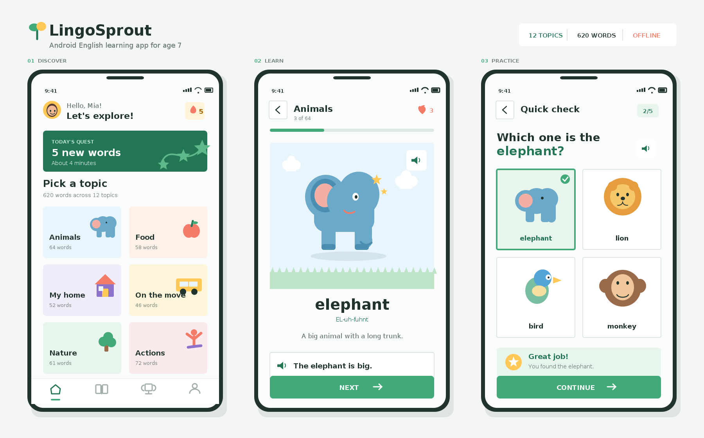

# LingoSprout

LingoSprout is an offline-first Android English starter app designed for children around age seven.



## Learning experience

- 620 words across 12 everyday topics
- Chinese meanings, visual cues, simple example sentences, and US English text-to-speech
- Animated learning cards and four-choice visual practice
- Automatic quick checks after every five learned words
- Local progress, daily goal, quiz score, and learning streak tracking
- No account, ads, analytics, network permission, or paid dependency

## Project layout

- `app/src/main/assets/words.tsv`: offline word catalog
- `app/src/main/java/.../ui/LingoSproutView.java`: responsive animated learning UI
- `app/src/main/java/.../data`: catalog and progress model
- `app/src/test`: catalog integrity and quiz generation tests

## Build

Prerequisites: JDK 17 and Android SDK Platform 35.

```bash
./gradlew testDebugUnitTest assembleDebug
```

The debug APK is generated at `app/build/outputs/apk/debug/app-debug.apk`.
